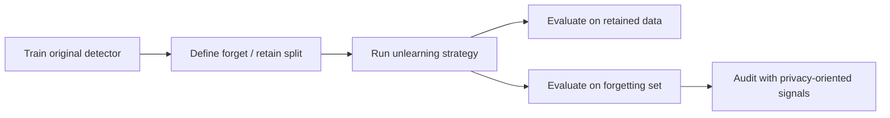

  

# Object Detection Unlearning

Public companion repository for my master's thesis in Artificial Intelligence and Data Engineering at the University of Pisa.

## Overview

This repository is the public-facing companion to my thesis work on machine unlearning for object detection.

The thesis focused on a gap I found in the literature: machine unlearning had been studied mainly for image classification, while object detection remained largely unexplored despite its relevance for privacy-sensitive and safety-critical applications.

The work framed object detection as an unlearning problem, built an experimental framework for it, and evaluated how forgetting affects both utility and privacy-oriented behavior.

## Thesis Context

- Degree: MSc in Artificial Intelligence and Data Engineering
- University: University of Pisa
- Thesis title: `Developing a Novel Perspective for Object Detection Based on Machine Unlearning`
- Supervisors: Prof. Mario Cimino, Dr. Marco Parola
- Academic year: `2025/2026`

## What I Worked On

My contribution centered on turning machine unlearning into a concrete research workflow for object detection rather than treating it as a direct transplant from classification.

- I structured the problem around two scenarios:
  - `User Privacy (UP)`: forgetting data to support privacy-driven deletion requirements
  - `Resolving Confusion (RC)`: removing the influence of noisy or misleading training signals
- I adapted the experimental workflow to object detection settings, where outputs are structured and include both classification and localization.
- I worked on the training and evaluation pipeline used to compare baseline models, golden retraining, fine-tuning-based unlearning, and subsequent extensions explored in the private research codebase.
- I contributed to metric logging, forgetting-set evaluation, checkpointing, visualization support, and experiment management across multiple iterations of the framework.

## Public-Safe Research Workflow

The full research code remains in a supervised private repository and is not mirrored here. What I can share publicly is the workflow and research structure.

In practice, the public-safe workflow can be summarized as:

1. Train or load an original object detector.
2. Build a forgetting setup for a target scenario.
3. Run an unlearning strategy such as exact retraining or approximate retraining.
4. Measure retained detection quality with object-detection metrics like `mAP` and `IoU`.
5. Measure forgetting behavior with privacy-oriented checks such as `Membership Inference Attack (MIA)` analysis.
6. Compare retained performance against forgetting effectiveness instead of treating either side in isolation.

## Research Scope

The thesis and private framework revolve around:

- Architectures:
  - `YOLOS`
  - `DETR`
  - later framework extensions also touched broader detector support in the private repo
- Datasets:
  - `Pascal VOC 2012`
  - `KITTI`
- Evaluation families:
  - standard object detection metrics
  - forgetting-set metrics
  - privacy-oriented auditing through MIA-style evaluation

## Key Takeaways

These are the main high-level findings I am comfortable sharing publicly from the thesis work:

- Object detection requires a dedicated unlearning workflow and should not be treated as a trivial extension of classification-based MU.
- In the evaluated `User Privacy` setup, the framework showed that effective forgetting can be approached without collapsing overall detection quality.
- Across most tested configurations, MIA behavior stayed close to random guessing, which is a useful signal that targeted information was no longer easily recoverable.
- Forget-set evaluation in object detection must be interpreted carefully, because image-level forgetting and structured outputs create subtleties that do not appear in plain classification tasks.

## What Is Not Included Here

This repository intentionally omits:

- the original private research codebase
- internal training scripts and implementation details that were developed in supervised academic work
- raw experiment artifacts, checkpoints, and weights
- full datasets, prepared splits, and private logs
- implementation details that go beyond a public portfolio-level presentation

## Repository Contents

- [docs/public-workflow.md](./docs/public-workflow.md): public technical summary of the workflow and thesis framing
- [assets/hero.png](./assets/hero.png): visual header asset for this repository

## Why This Repo Exists

I wanted a public place on my GitHub profile to show the thesis direction and my contribution without re-uploading a private supervised repository or disclosing material that should remain private.

This repo is therefore meant as a case study: enough to communicate the problem, the workflow, and the relevance of the work, while respecting the boundaries of the original research environment.

## Notes

- The original research implementation was developed in a private repository owned outside my account.
- This public companion repo is meant for portfolio and communication purposes.
- If the thesis manuscript becomes safely shareable in the future, I can add a public reference or archival link here.
